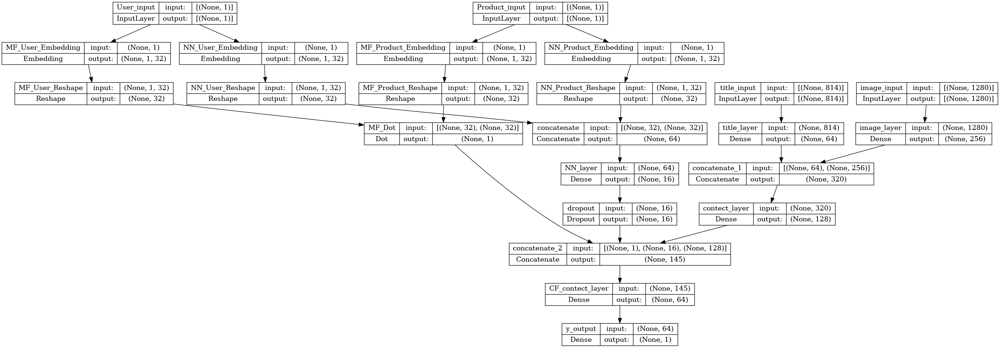

# SDSC4016 Fundamentals of Machine Learning II

SDSC4016 Project:

## Description

Deep learning based Recommender systems Using Amazon Reviews

## Getting Started

### Dependencies

- Python
  - Python 3.10+
  - Jupyter
  - tensorflow

### Install mini-conda and mamba

```bash
wget https://repo.anaconda.com/miniconda/Miniconda3-latest-Linux-x86_64.sh
bash ./Miniconda3-latest-Linux-x86_64.sh
conda install mamba -n base -c conda-forge
```

### Set up conda environment

```bash
mamba create -n tf
mamba activate tf
```

### Installing dependencies

```bash
# conda or mamba
mamba install -c conda-forge tensorflow-gpu
mamba install -c nvidia cuda-nvcc
mamba install -c conda-forge Jupyter ipykernel pylint autopep8
mamba install -c conda-forge pandas numpy scikit-learn tqdm wordcloud nltk
pip install 
```

#### Fetching image only

1. You can run it by ```python src/fetcher.sh```

#### Run the code

1. You can run it by ```script.sh```

2. Or you can run it by the following command:

    ```bash
    source ~/miniconda3/etc/profile.d/conda.sh
    source ~/miniconda3/etc/profile.d/mamba.sh
    mamba activate tf
    export TF_CPP_MIN_LOG_LEVEL=1
    python src/script.py
    ```

### Image location

- Path: ```./image/```

### Model Structure 



